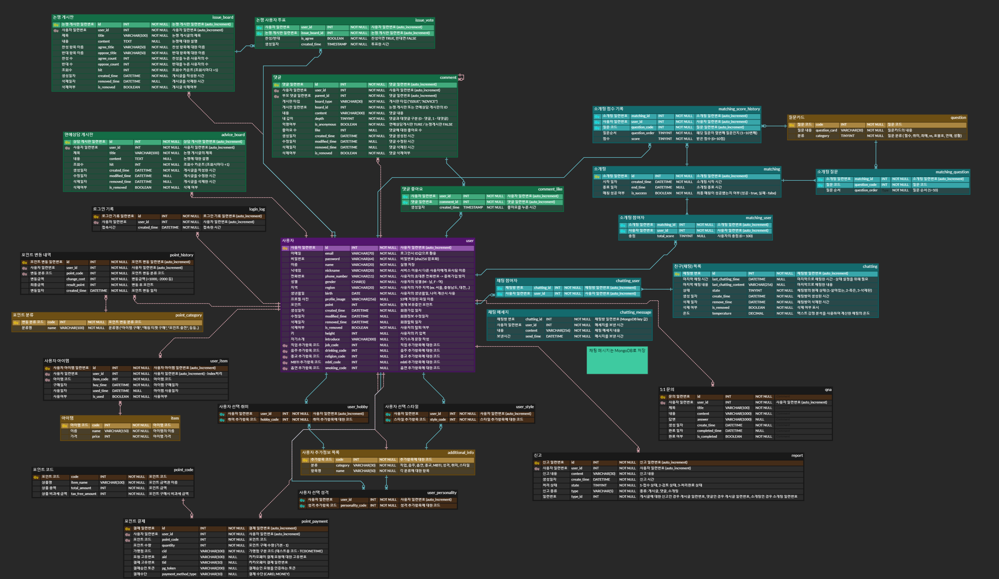
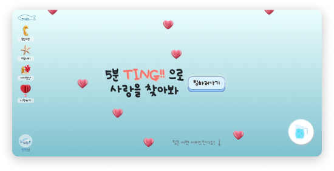
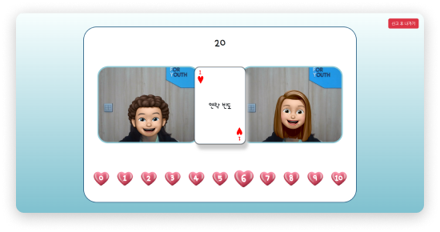
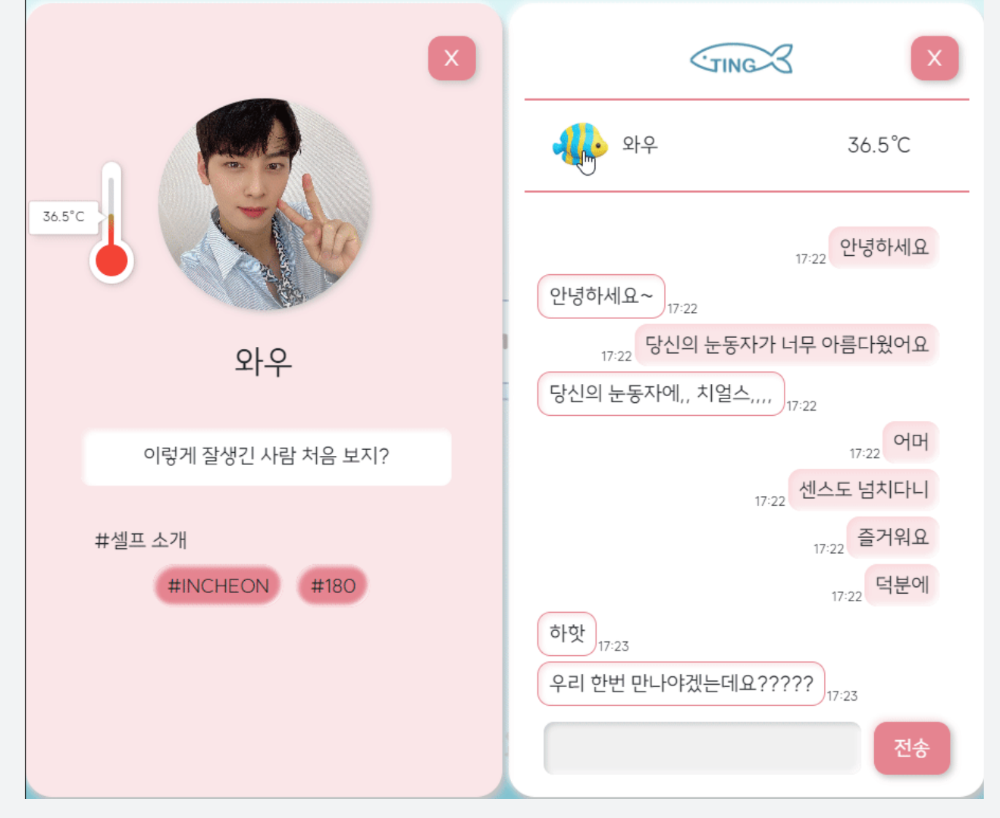
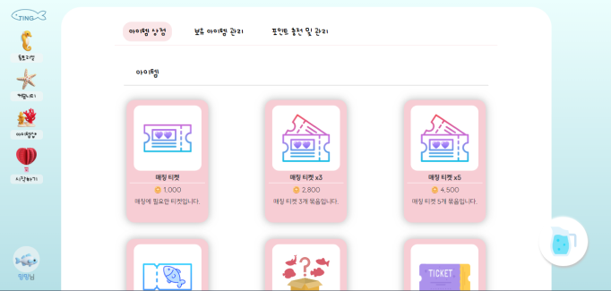

# 랜덤 소개팅 서비스 [TING]

### 1️⃣ 프로젝트 개요

📌 **개발 기간**

| 개발 기간 | 2023.07.10 ~ 2023.08.18 (6주)
| --- | --- |

---

📌 **팀원 소개**

| 팀원 | 역할 | 
| --- | --- |
| 변민지 | 팀장, FE |
| 이은석 | FE |
| 권기연 | FE |
| 송찬환 | BE, Infra |
| 김하영 | BE |
| 정수정 | BE |

---

📌 **기획 의도**

| 소개팅에서 무슨 말을 해야하지..? |
| --- |

| 주변에 소개시켜줄 사람도 없고.. |
| --- |

| 막상 소개팅을 나가도 사진이랑 실물이 너무 다른걸..? |
| --- |

---

📌 **목표**

| 사용자의 선호도, 입력 정보 등을 기반한 알고리즘을 통하여 적합한 상대를 매칭한다. |
| --- |

| 실시간으로 질문 카드에 대한 대화를 나누고, 점수를 매긴다. |
| --- |

| 상대와 매칭이 성공하면, 친구 목록에 추가되어 채팅이 가능하다. |
| --- |

| 커뮤니티 게시판을 통해 다수의 사용자들과 소통을 할 수 있다. |
| --- |

| 포인트 충전 및 사용이 가능하다. |
| --- |

---

### 2️⃣ 서비스 소개

📌 **주요 기능 : 랜덤 매칭 알고리즘**

- 사용자가 입력한 선택 정보를 기반으로 어울리는 사용자 매칭
- 남성 사용자와 여성 사용자의 점수, 대기 시간 가중치를 합하여 50점이 넘는 경우 매칭이 이루어짐
- 한 번 매칭된 사용자는 또다시 매칭되지 않도록 제외

📌 **주요 기능 : 질문 카드 제시**

- 대화가 어색하지 않도록 질문 카드 제시
- 카드에 대한 대답을 통해 점수 부여 가능
- DB에 저장된 100여가지의 질문
- 카테고리 별로 나누어 필수 질문 3개와 랜덤 질문 7개 등장

📌 **주요 기능 : 채팅 기능**

- 매칭이 성공한 경우 친구 목록에 추가되어, 채팅이 가능하도록 함
- 웹소켓을 사용하여 실시간 대화 가능
- 안읽은 메세지, 마지막 대화한 메세지 확인 가능
- 프로필에서 상대와의 채팅 내용을 분석하여 얻은 친밀도(온도) 확인 가능

📌 **주요 기능 : 커뮤니티**

- 논쟁 게시판을 통해 화제가 되는 이슈를 A vs B 방식으로 선택 가능
- 익명의 연애 상담 게시판을 통해 연애 상담 가능
- 댓글 및 좋아요 반응으로 다른 유저와의 소통 가능

📌 **주요 기능 : 아이템샵**

- 카카오페이를 통해 가상 화폐 충전 가능
- 포인트로 매칭 티켓, 랜덤 박스 등 아이템 구매 가능

---

### 3️⃣ 기술 스택

- Back-End
  - Java
  - Spring Boot
  - Spring JPA
  - Spring Security
  - Stomp
  - JWT
  - OAuth2
  - Openvidu
- Front-End
  - React
  - Redux
  - Redux-Persist
  - JavaScript
  - Node.js
  - Axios
  - Stomp.js
  - Openvidu
- Infra
  - Docker
  - Ngnix
  - Jenkins
  - Amazon S3
- DB
  - MySQL
  - MongoDB
- Team Collaboration Tool
  - Gitlab
  - Jira
  - Notion
  - Figma
  - Mattermost
  - Webex

---

### 4️⃣ ERD

---

### 5️⃣ 서비스 화면

- 메인 

 

- 매칭 

 

- 채팅 

 

- 아이템샵 

 
