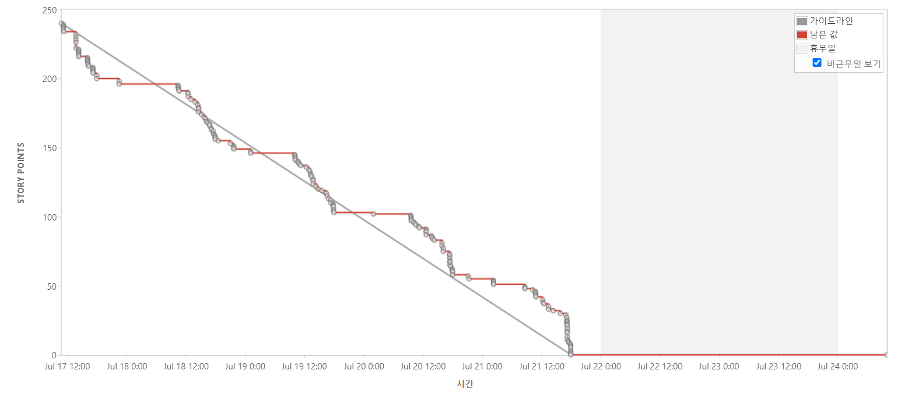

# 1-1. Issue Management

### 이슈 관리 소프트웨어

- JIRA
- Notion

### JIRA

> JIRA 주차별 번다운차트
> 
- 2주차 - 기획 및 설계
    
    
    
- 3주차 - 기본 기능 구현
    
    
    
- 4주차 - 기본 기능 구현2
    
    
    
- 5주차 - 추가 기능 구현
    
    
    
- 6주차 - 프로젝트 마무리

> 컴포넌트
> 

### Notion

> 전체 일정 캘린더
> 

> 회의 기록
> 

> 피드백 및 자료 정리
> 

