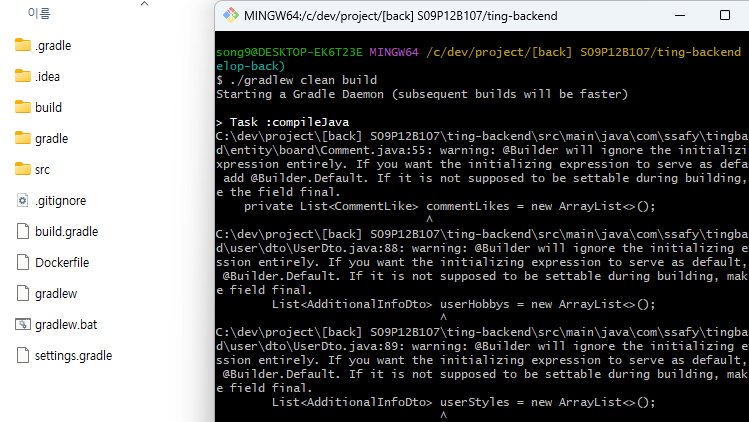

# 2-3. SpringBoot

### SpringBoot Build and Run

1. 백엔드 스프링부트 프로젝트 최상위 경로로 이동
2. `./gradlew clean build`




1. `java -jar /build/libs/{ PROJECT_NAME }.jar` 


### SpringBoot - application.yml

```
server:
  port: 8080
  ssl:
    key-store: { KEY_STORE_PATH }
    key-store-type: { KEY_STORE_TYPE }
    key-store-password: { KEY_STORE_PASSWORD }

spring:
  jackson:
    time-zone: Asia/Seoul

  datasource:
    driver-class-name: { DB_DRIVER_CLASS_NAME }
    url: { DB_URL }
    username: { DB_USERNAME }
    password: { DB_PASSWORD }

  jpa:
    open-in-view: false
    hibernate:
      ddl-auto: update

  # 이메일 설정
  mail:
    host: { MAIL_HOST }
    port: { MAIL_PORT }
    username: { MAIL_USERNAME }
    password: { MAIL_PASSWORD }
    properties:
      mail:
        smtp:
          auth: true
          starttls:
            enable: true

  # mongoDB
  data:
    mongodb:
      host: { MONGO_HOST }
      port: { MONGO_PORT }
      database: { MONGO_DATABASE }
      authentication-database: { MONGO_AUTHENTICATION_DATABASE }
      auto-index-creation: true
      username: { MONGO_USERNAME }
      password: { MONGO_PASSWORD }

jwt:
  secretKey: { JWT_SECRET_KEY }

openvidu:
  url: { OPENVIDU_URL }
  secret: { OPENVIDU_SECRET }

ncloud:
  sens:
    serviceId: { SENS_SERVICE_ID }
    accessKeyId: { SENS_ACCESS_KEY_ID }
    secretKey: { SENS_SECRET_KEY }
    senderPhone: { SENS_SENDER_PHONE }

# profile 이미지 파일경로
file:
  path: /app/profile
  fishSkinPath: /skin/fish

# natural language api
cloud:
  gcp:
    credentials:
      location: { GCP_CREDENTIALS_LOCATION }

payment:
  kakaopay:
    admin:
      key: { KAKAO_ADMIN_KEY }
    cid: { KAKAO_CID }
    url:
      ready: { KAKAO_READY_URL }
      approve: { KAKAO_APPROVE_URL }
    redirectUrl:
      approvalRedirectUrl: { KAKAO_APPROVAL_REDIRECT_URL }
      cancelRedirectUrl: { KAKAO_CANCEL_REDIRECT_URL }
      failRedirectUrl: { KAKAO_FAIL_REDIRECT_URL }
```

### SpringBoot - build.gradle

```
plugins {
    id 'java'
    id 'org.springframework.boot' version '2.7.12'
    id 'io.spring.dependency-management' version '1.0.15.RELEASE'
}

group = 'com.ssafy'
version = '0.0.1-SNAPSHOT'

java {
    sourceCompatibility = '11'
}

configurations {
    compileOnly {
        extendsFrom annotationProcessor
    }
}

repositories {
    mavenCentral()
}

dependencies {
    implementation 'org.springframework.boot:spring-boot-starter-data-jpa'
    implementation 'org.springframework.boot:spring-boot-starter-security'
    implementation 'org.springframework.boot:spring-boot-starter-web'
    implementation 'org.springframework.boot:spring-boot-starter-websocket'
    implementation 'com.google.code.gson:gson'
    implementation group: 'io.jsonwebtoken', name: 'jjwt', version: '0.9.1'
    implementation 'org.springframework.boot:spring-boot-starter-mail'
    implementation 'org.springframework.boot:spring-boot-starter-data-mongodb'
    implementation group: 'org.modelmapper', name: 'modelmapper', version: '2.3.8'
    implementation 'org.springframework.boot:spring-boot-starter'
    implementation 'org.webjars:sockjs-client:1.1.2'
    implementation 'org.webjars:stomp-websocket:2.3.3-1'

    // openvidu
    implementation 'io.openvidu:openvidu-java-client:2.28.0'

    // NAVER CLOUD PLATFORM SENS SMS API
    implementation group: 'org.apache.httpcomponents', name: 'httpclient', version: '4.5.13'

    // 채팅
    developmentOnly 'org.springframework.boot:spring-boot-devtools'

    //google cloud natural language api
    implementation 'com.google.cloud:google-cloud-language:2.21.0'
    implementation 'com.google.auth:google-auth-library-oauth2-http:1.18.0'

    compileOnly 'org.projectlombok:lombok'
    runtimeOnly 'com.mysql:mysql-connector-j'
    annotationProcessor 'org.projectlombok:lombok'
    testImplementation 'org.springframework.boot:spring-boot-starter-test'
    testImplementation 'org.springframework.security:spring-security-test'
}

tasks.named('test') {
    useJUnitPlatform()
}
```