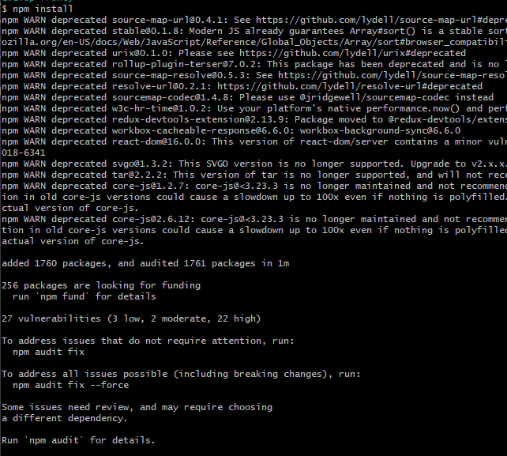

# 2-4. React

### React Build

1. 프론트엔드 프로젝트 최상위 경로로 이동
2. `npm install` (or `npm i`)



1. 빌드 & 실행
    1. 실행 : `npm start` (개발 모드)
        
        
        
    2. 빌드 : `npm run build` (정적 파일로 빌드)


- 빌드 후 나온 정적파일을 웹서버의 home directory에 옮기면 배포과정이 완료됨

### React - package.json (library version)

```
{
  "name": "ting-frontend",
  "version": "0.1.0",
  "private": true,
  "dependencies": {
    "@emotion/react": "^11.11.1",
    "@emotion/styled": "^11.11.0",
    "@mui/icons-material": "^5.14.3",
    "@mui/material": "^5.14.4",
    "@reduxjs/toolkit": "^1.9.5",
    "@stomp/stompjs": "^7.0.0",
    "@testing-library/jest-dom": "^5.17.0",
    "@testing-library/react": "^13.4.0",
    "@testing-library/user-event": "^13.5.0",
    "aos": "^2.3.4",
    "axios": "^1.4.0",
    "bootstrap": "^5.3.1",
    "chart.js": "^4.3.3",
    "date-fns": "^2.30.0",
    "dayjs": "^1.11.9",
    "font-awesome": "^4.7.0",
    "http-proxy-middleware": "^2.0.6",
    "jwt-decode": "^3.1.2",
    "lodash": "^4.17.21",
    "openvidu-browser": "^2.28.0",
    "react": "^18.2.0",
    "react-bootstrap": "^2.8.0",
    "react-chartjs-2": "^5.2.0",
    "react-confetti": "^6.1.0",
    "react-datepicker": "^4.16.0",
    "react-dom": "^18.2.0",
    "react-fullpage": "^0.1.19",
    "react-js-pagination": "^3.0.3",
    "react-redux": "^8.1.1",
    "react-router-dom": "^6.14.2",
    "react-scripts": "5.0.1",
    "react-thermometer-component": "^1.0.1",
    "react-webcam": "^7.1.1",
    "redux": "^4.2.1",
    "redux-persist": "^6.0.0",
    "sockjs-client": "^1.6.1",
    "stompjs": "^2.3.3",
    "sweetalert2": "^11.7.20",
    "web-vitals": "^2.1.4"
  },
  "scripts": {
    "start": "react-scripts start",
    "build": "react-scripts build",
    "test": "react-scripts test",
    "eject": "react-scripts eject"
  },
  "eslintConfig": {
    "extends": [
      "react-app",
      "react-app/jest"
    ]
  },
  "browserslist": {
    "production": [
      ">0.2%",
      "not dead",
      "not op_mini all"
    ],
    "development": [
      "last 1 chrome version",
      "last 1 firefox version",
      "last 1 safari version"
    ]
  },
  "devDependencies": {
    "redux-devtools-extension": "^2.13.9"
  }
}
```