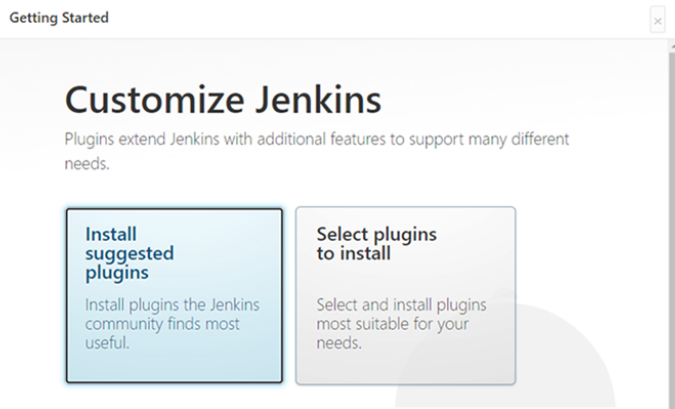

# 3-4. Jenkins Container Setting

### 알고 갈 점

Jenkins 는 개발 단계에서 CI/CD 환경 구축을 위해 사용한 프로그램입니다.

개발 완료된 소스코드를 배포, 실행 할 때 필수로 설치해야 하는 프로그램은 아니며, Jenkins를 사용하지 않은 수동 배포 방법을 4번 항목에 작성하였습니다.

### Jenkins 이미지 다운로드

```bash
$ docker pull jenkins/jenkins:lts
```

### jenkins 컨테이너 실행 & Volume 마운트

```bash
$ docker run --name jenkins-docker -d -p 8081:8080 -v /jenkins:/var/jenkins_home jenkins/jenkins:lts
```

- —name : 컨테이너 이름 설정
- -v : 볼륨 마운트 (호스트환경의 /jenkins 와 컨테이너 내부의 /var/jenkins_home 폴더를 연결
- -d : 백그라운드로 실행
- -p : 포트 연결 (호스트 환경의 8081과 컨테이너 내부의 3306 포트를 연결)

### 기본 플러그인 설치



### 추가 플러그인 설치

- gitlab
- ssh agent

### 프론트엔드 Jenkinsfile

```bash
pipeline {
    agent any     // 사용 가능한 에이전트에서 이 파이프라인 또는 해당 단계를 실행

    environment {
        GIT_URL = '{GIT_ADDRESS}'
        CONTAINER_NAME = '{CONTAINER_NAME}'
        IMAGE_NAME = '{IMAGE_NAME}'
        JENKINS_OPENVIDU_PATH = '{JENKINS_OPENVIDU_PATH}'
        TARGET_HOST = '{TARGET_HOST}'
    }

    stages {
        stage('Git clone') {
            steps {
                git branch: 'develop-front',
                    url: "${GIT_URL}",
                    credentialsId: 'gitlab-access-token'
            }

            post {
                success {
                    sh 'echo "Successfully Cloned Repository"'
                }
                failure {
                    sh 'echo "Fail Cloned Repository"'
                }
            }
        }

        stage('Openvidu stop') {
            steps {
                script {
                    try {
                        // openvidu 가 이미 실행중이 아니면 건너뜀
                        sh 'echo "openvidu stop"'
                        sh '''
                            cd /var/jenkins_home/opt/openvidu
                            ./openvidu stop
                        '''
                    } catch (Exception e) {
                        // Openvidu가 이미 중지 상태입니다.
                        echo 'Openvidu alraedy stopped'
                    }
                }
            }

            post {
                success {
                    sh 'echo "Successfully Stop Openvidu"'
                }
                failure {
                    sh 'echo "Fail Stop Openvidu"'
                }
            }
        }

        stage('Docker delete') {
            steps {
                script {
                    try {
                        // 이미지가 존재하면 삭제합니다.
                        sh "docker image rm ${IMAGE_NAME}"
                    } catch (Exception e) {
                        // 이미지가 존재하지 않는 경우 에러가 발생할 수 있으므로, 에러를 무시합니다.
                        echo "Docker image ${IMAGE_NAME} does not exist. Skipping deletion."
                    }
                }
            }

            post {
                success {
                    sh 'echo "docker delete Success"'
                }
                failure {
                    sh 'echo "docker delete Fail"'
                }
            }
        }

        stage('Dockerizing') {
            steps {
                sh 'echo "Image Bulid Start"'
                sh """
                    cd ting-frontend
                    docker build -t ${IMAGE_NAME} . 
                """
            }
            post {
                success {
                    sh 'echo "Bulid Docker Image Success"'
                }

                failure {
                    sh 'echo "Bulid Docker Image Fail"'
                }
            }
        }

        stage('Deploy') {
            steps {
                script {
                    timeout(time: 5, unit: 'SECONDS') {
                        sshagent (credentials: ['i9b107-access-key']) {
                            sh """
                                ssh -o StrictHostKeyChecking=no ubuntu@i9b107.p.ssafy.io '
                                cd /jenkins/opt/openvidu
                                ./openvidu start &
                                '
                            """
                        }
                    }
                }
            }
            post {
                success {
                    echo 'deploy success'
                }

                failure {
                    echo 'deploy failed'
                }
            }
        }
    }
}
```

### 백엔드 Jenkinsfile

```bash
pipeline {
    agent any 	// 사용 가능한 에이전트에서 이 파이프라인 또는 해당 단계를 실행
    
    environment {
        GIT_URL = "{GIT_URL}"
        CONTAINER_NAME = "{CONTAINER_NAME}"
        IMAGE_NAME = "{IMAGE_NAME}"
        KEYSTORE_PATH = "{KEYSTORE_PATH}"
        SPRING_RESOURCE_PATH = "{SPRING_RESOURCE_PATH}"
        VOLUME_NAME = "{VOLUME_NAME}"
    }
    
    stages {
        stage('Git clone') {
            steps {
                git branch: 'develop-back',
                    url: "${GIT_URL}",
                    credentialsId: "gitlab-access-token"
            }
            
            post {
                success { 
                    sh 'echo "Successfully Cloned Repository"'
                }
                failure {
                    sh 'echo "Fail Cloned Repository"'
                }
            }    
        }
        
        stage('Build And Test') { 
            steps {
                // ssl keystore 복사해오는 과정
                sh "cp ${KEYSTORE_PATH}/keystore.p12 ${SPRING_RESOURCE_PATH}/keystore.p12"
                
            	// gralew이 있어야됨. git clone해서 project를 가져옴.
                sh '''
                    cd ting-backend
                    chmod +x ./gradlew
                    ./gradlew clean build
                '''
            }
            post {
                success {
                    echo 'gradle build success'
                }

                failure {
                    echo 'gradle build failed'
                }
            }
        }
        
        stage('Docker delete') {
            steps {
                script {
                    try {
                        // 컨테이너가 존재하면 삭제합니다.
                        sh "docker stop ${CONTAINER_NAME}"
                        sh "docker rm -f ${CONTAINER_NAME}"
                    } catch (Exception e) {
                        // 컨테이너가 존재하지 않는 경우 에러가 발생할 수 있으므로, 에러를 무시합니다.
                        echo "Docker container ${CONTAINER_NAME} does not exist. Skipping deletion."
                    }
                    
                    try {
                        // 이미지가 존재하면 삭제합니다.
                        sh "docker image rm ${IMAGE_NAME}"
                    } catch (Exception e) {
                        // 이미지가 존재하지 않는 경우 에러가 발생할 수 있으므로, 에러를 무시합니다.
                        echo "Docker image ${IMAGE_NAME} does not exist. Skipping deletion."
                    }
                }
            }

            
            post {
                success { 
                    sh 'echo "docker delete Success"'
                }
                failure {
                    sh 'echo "docker delete Fail"'
                }
            }
        }
        
        stage('Dockerizing'){
            steps{
                sh 'echo " Image Bulid Start"'
                sh """
                    cd ting-backend
                    docker build -t ${IMAGE_NAME} . 
                """
            }
            post {
                success {
                    sh 'echo "Bulid Docker Image Success"'
                }

                failure {
                    sh 'echo "Bulid Docker Image Fail"'
                }
            }
        }
        
        stage('Deploy') {
            steps {
                sh "docker run --name ${CONTAINER_NAME} -v ${VOLUME_NAME}:/app/profile -d -p 5157:8080 ${IMAGE_NAME}"
            }

            post {
                success {
                    echo 'deploy success'
                }

                failure {
                    echo 'deploy failed'
                }
            }
        }
    }
}
```