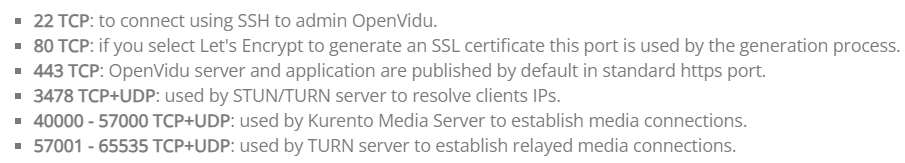

# 4-3. Openvidu Deployment

### Openvidu 서버의 사용 포트



- 위에 적힌 포트를 기존에 사용하고 있지 않아야 openvidu 서버를 배포할 수 있다

### 사전 작업

- Docker, Docker-compose 가 설치되어 있어야 한다
- 22, 80, 443, 3478, 40000 - 57000, 57001 - 65535 포트가 열려 있어야 한다

## Openvidu Deploy

### 1. openvidu 를 다운로드 할 폴더로 이동

```bash
$ cd /opt
```

### 2. openvidu 소스코드 다운로드

```bash
$ curl https://s3-eu-west-1.amazonaws.com/aws.openvidu.io/install_openvidu_latest.sh | bash
```

- 다운로드가 완료되면 openvidu/ 폴더가 생성

### 3. openvidu 설정

```bash
=======================================
Openvidu Platform successfully installed.
=======================================

// 1. Go to openvidu folder:
$ cd openvidu

// 2. Configure DOMAIN_OR_PUBLIC_IP and OPENVIDU_SECRET in .env file:
$ vi .env
```

- openvidu 폴더 안으로 이동
- `vi .env`로 Domain과 Secret key 를 설정한다

```bash
# OpenVidu configuration
# ----------------------
# Documentation: https://docs.openvidu.io/en/stable/reference-docs/openvidu-config/

# NOTE: This file doesn't need to quote assignment values, like most shells do.
# All values are stored as-is, even if they contain spaces, so don't quote them.

# Domain name. If you do not have one, the public IP of the machine.
# For example: 198.51.100.1, or openvidu.example.com
DOMAIN_OR_PUBLIC_IP=

# OpenVidu SECRET used for apps to connect to OpenVidu server and users to access to OpenVidu Dashboard
OPENVIDU_SECRET=

# Certificate type:
# - selfsigned:  Self signed certificate. Not recommended for production use.
#                Users will see an ERROR when connected to web page.
# - owncert:     Valid certificate purchased in a Internet services company.
#                Please put the certificates files inside folder ./owncert
#                with names certificate.key and certificate.cert
# - letsencrypt: Generate a new certificate using letsencrypt. Please set the
#                required contact email for Let's Encrypt in LETSENCRYPT_EMAIL
#                variable.
CERTIFICATE_TYPE=selfsigned

# If CERTIFICATE_TYPE=letsencrypt, you need to configure a valid email for notifications
LETSENCRYPT_EMAIL=user@example.com
...
```

### 4. openvidu 실행

```bash
$ ./openvidu start
```