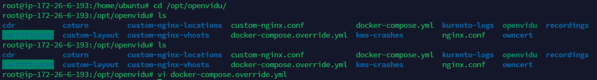

# 4-4. Frontend Deployment

### Frontend Dockerfile

```bash
FROM node:latest as builder

# 작업 폴더를 만들고 npm 설치
RUN mkdir /usr/src/app

WORKDIR /usr/src/app
ENV PATH /usr/src/app/node_modules/.bin:$PATH
COPY package.json /usr/src/app/package.json

# npm install
RUN npm install --silent
RUN npm install react-scripts@3.4.1 -g --silent

# 소스를 작업폴더로 복사하고 빌드
COPY . /usr/src/app
RUN npm run build

FROM nginx:latest
# nginx의 기본 설정을 삭제하고 앱에서 설정한 파일을 복사
RUN rm -rf /etc/nginx/conf.d
COPY conf /etc/nginx

# 위에서 생성한 앱의 빌드산출물을 nginx의 샘플 앱이 사용하던 폴더로 이동
COPY --from=builder /usr/src/app/build /usr/share/nginx/html

# 5442포트 오픈하고 nginx 실행
EXPOSE 5442
CMD ["nginx", "-g", "daemon off;"]
```

- openvidu 서비스와 frontend 를 함께 서비스하기 위해 openvidu 에서 제공하는 포트인 5442 포트로 expose 한다.

## EC2 서버에서 프론트엔드 수동 배포  (Jenkins 사용 x)

### 사전 작업

- 3-3 의 openvidu 서버 배포 상태여야 한다
- `{frontend_root}/conf/conf.d/default.conf` 에 nginx 설정 파일이 작성되어 있어야 한다

- default.conf 파일
    
    ```bash
    server {
        listen 5442;
    
        location / {
            root   /usr/share/nginx/html;
            index  index.html index.htm;
            try_files $uri $uri/ /index.html;
        }
        
        location /api {
            proxy_pass http://i9b107.p.ssafy.io;
        }
        
        error_page   500 502 503 504  /50x.html;
        
        location = /50x.html {
            root   /usr/share/nginx/html;
        }
    }
    ```
    

### 1. git 을 통해 소스코드를 clone

```
# git clone {GIT_HTTPS_URL}
```

- 원하는 폴더경로로 이동하여 진행

### 2. frontend프로젝트의 Dockerfile이 위치한 최상위 폴더로 이동

### 3. Dockerfile 빌드

```
# docker build -t ${IMAGE_NAME} . 
```

### 4. Openvidu 서비스에 frontend 배포

```bash
// openvidu가 설치된 폴더로 이동
$ cd /opt/openvidu

// 목록 확인
$ ls

// openvidu 서비스의 docker-compose 파일 열기
$ vi docker-compose.override.yml
```



```bash
// docker-compose.override.yml 파일

version: '3.1'
  
services:
    # --------------------------------------------------------------
    #
    #    Change this if your want use your own application.
    #    It's very important expose your application in port 5442
    #    and use the http protocol.
    #
    #    Default Application
    #
    #    Openvidu-Call Version: 2.28.0
    #
    # --------------------------------------------------------------
    app:
        image: { FRONTEND_IMAGE_NAME }
        restart: on-failure
        network_mode: host
        ports:
            - 5442:80
        environment:
            - SERVER_PORT=5442
            - OPENVIDU_URL=http://localhost:5443
            - OPENVIDU_SECRET=${OPENVIDU_SECRET}
            - CALL_OPENVIDU_CERTTYPE=${CERTIFICATE_TYPE}
            - CALL_PRIVATE_ACCESS=${CALL_PRIVATE_ACCESS:-}
            - CALL_USER=${CALL_USER:-}
            - CALL_SECRET=${CALL_SECRET:-}
            - CALL_ADMIN_SECRET=${CALL_ADMIN_SECRET:-}
            - CALL_RECORDING=${CALL_RECORDING:-}
        logging:
            options:
                max-size: "${DOCKER_LOGS_MAX_SIZE:-100M}"
~                                                                                                                                                                     
~
```

- 상위에서 dockerfile 로 만든 프론트엔드 이미지를 app: image: 에 입력한다

### 5. openvidu 시작 or 재시작

```bash
// 시작
$ ./openvidu start

// 재시작 (이미 openvidu가 실행되어 있을 경우)
$ ./openvidu restart
```